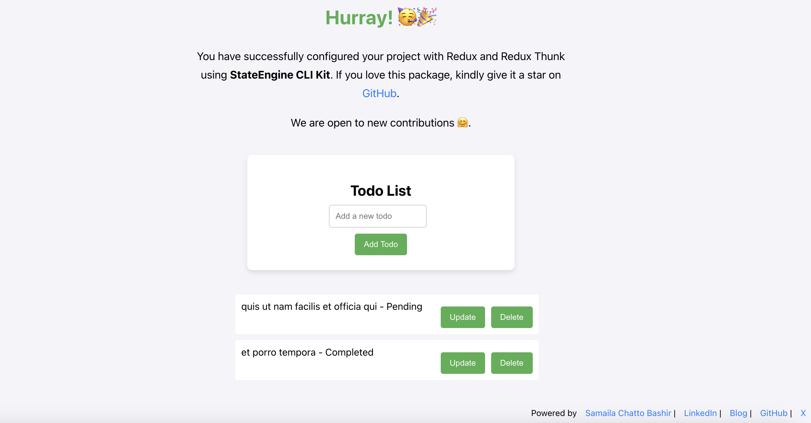

# Table of Contents

1. [Introduction](#stateengine-cli-kit)
   - [Suitable for Frontend Projects Configured with TypeScript](#suitable-for-frontend-projects-configured-with-typescript) -[What's Included](#whats-included)
2. [Features in Version 1.0.0](#features-in-version-100)
3. [Commands](#commands)
4. [Example Usage](#example-usage)
   - [Using NPX](#alternatively-use-npx-directly)
5. [Setting Up the Redux Provider](#setting-up-the-redux-provider)
6. [Viewing the Sample Todo App](#viewing-the-sample-todo-app)
7. [Generate Command](#generate-command)
8. [Configuration File](#configuration-file)
9. [Supported Frameworks and Libraries](#supported-frameworks-and-libraries)
10. [Contributions](#contributions)

# StateEngine CLI Kit

StateEngine CLI Kit is a powerful and easy-to-use command-line tool that simplifies setting up your choice of state management library in any frontend framework or library, such as React (e.g. Redux [Saga or Thunk], React Query, Zustand), Vue (Pinia or Vuex), Angular (NgRx and Akita), Svelte, and others. This CLI kit is especially designed for any frontend project configured with TypeScript, helping you to set up a standard project folder structure for your state management. It provides state management setup with configuration files and folders to quickly get started with managing state in your frontend project.

> The vision behind this project is to build a powerful, frontend-agnostic state configuration engine that enables frontend engineers to follow best practices inspired by professional frontend engineers in the industry, enabling easy configuration of state management in any frontend library or framework of your choice in the least possible time, reducing repetitive tasks.
>
> — [Samaila Chatto Bashir](https://samailabashir.com)

## Suitable for Frontend Projects Configured with TypeScript

StateEngine CLI Kit is built with TypeScript in mind. It generates TypeScript files and sets up type-safe configurations. This ensures your your choice of state management library store benefits from strong typing and helps catch potential bugs during development.

### What's Included:

- **Redux Store**: The `store/index.ts` file provides a ready-to-use Redux store configuration.
- **Slices**: Automatically generated slices for state management.
- **Sagas or Thunks**: Depending on your choice, the CLI will generate a corresponding saga or thunk for asynchronous logic.
- **Sample Component**: A basic Todo app component that integrates with Redux and includes example CRUD functionality.

🔴 _Attention: This documentation is focused on state management setup on React projects configured with TypeScript, and the state management tool currently available is Redux with the option to use `Redux Saga` or `Redux Thunk`. I will be updating the [status table](#stateengine-cli-kit-framework-and-library-support) below on the state management options added to the project._

## Features in Version 1.0.0

- **Seamless choice of state management library Setup**: Automatically configures your choice of state management library e.g. Redux with `@reduxjs/toolkit`, `redux-persist`, and other required dependencies for React projects.
- **Saga or Thunk**: Gives you the choice to set up your Redux store with either `Redux Saga` or `Redux Thunk` for managing asynchronous logic.
- **Generates Redux Structure**: Automatically creates a `store` folder with slices, sagas, actions, and reducers, following a well-structured pattern for React projects configured with Redux.
- **Todo Component Example**: Provides a pre-configured, ready-to-use Todo component, complete with your choice of state management library and a basic UI to fetch, add, update, and delete todos.
- **Flexibility**: Easily customizable after initial setup to suit your specific project needs.
- **TypeScript Support**: Specifically designed for any frontend framework, such as React, Vue, Angular, Svelte, and others built with TypeScript.
- **Cleaner Project Organization**: Automatically separates concerns with a clear folder structure for your choice of state management library.

🟢 _Note: These features are highlited based on the current progress of the project which is mostly focused on React JS setup using Redux with middlewares like Redux Saga or Redux Thunk. As more features are being added e.g libraries, the documentation will be updated accordingly._

## Commands

StateEngine CLI Kit comes with three primary commands to help you set up and manage your your choice of state management library with ease.

💡 **seck** or **SECK** is an acronym for State Engine CLI Kit

### 1. `seck init`

The `init` command is the starting point of the setup process. This command allows you to configure your your choice of library or framework and the state management library you prefer.

```bash
seck init
```

**Options**:

- `--saga`: Initializes your project with Redux Saga for managing side effects.
- `--thunk`: Initializes your project with Redux Thunk for asynchronous logic.

This command automatically installs the necessary dependencies (Redux, `@reduxjs/toolkit`, `redux-persist`, and either Redux Thunk or Saga) and sets up your Redux store with best practices.

Additionally, it generates:

- A Redux store configuration file.
- A sample slice and saga for a Todo model.
- A sample `TodoComponent` with a basic UI and Redux integration.
- A corresponding CSS Module for styling the component.

### 2. `seck generate <model>`

The `generate` command allows you to create additional Redux slices and sagas for new models, which helps in extending the store for new features or entities.

```bash
seck generate users
```

This command:

- Creates a new slice for the model in `src/store/slices`.
- Creates a new saga for the model in `src/store/sagas`.
- Adds the newly created saga to the root saga.
- Includes a sample CRUD configuration for the new model.

[Check this section](#generate-command) for a detailed breakdown on what you can do with `generate model`

### 3. `seck reset`

The `reset` command cleans up the existing store structure and removes all installed node modules related to Redux (including Thunk or Saga).

```bash
seck reset
```

This command:

- Removes the `src/store` directory.
- Removes the `src/todos` directory that contains the sample Todo component.
- Uninstalls the related Redux packages from the project.

## Example Usage

#### Create a React app with TypeScript template

To get started, create a new React app with the TypeScript template by running:

```bash
npx create-react-app my-app --template typescript
```

#### Install the package

Install the StateEngine CLI Kit package using npm:

```bash
npm install stateengine-cli-kit
```

Alternatively, you can use npx to run the CLI without installing it globally:

```bash
npx stateengine-cli-kit <command>
```

For example:

```bash
npx stateengine-cli-kit init
```

#### Add SECK to your scripts

After installing the package, it's recommended to add SECK commands to your `package.json` scripts for easier access. Here's how you can do it:

1. Open your `package.json` file.
2. In the "scripts" section, add the following entries:

```json
"scripts": {
  // ... other scripts ...
  "seck:init": "seck init",
  "seck:init:saga": "seck init --saga",
  "seck:init:thunk": "seck init --thunk",
  "seck:generate": "seck generate",
  "seck:reset": "seck reset"
}
```

Now you can run the commands using npm or yarn:

```bash
npm run seck:init
# or
yarn seck:init
```

#### Alternatively, use npx directly:

If you prefer not to modify your `package.json`, you can always run SECK commands directly using npx:

```bash
npx stateengine-cli-kit init
npx stateengine-cli-kit init --saga
npx stateengine-cli-kit init --thunk
```

This method works without adding scripts, but requires typing `npx` before each command.

## Setting Up the Redux Provider

Once you have initialized StateEngine CLI Kit and your Redux store is configured, you'll need to update your main entry point (`index.tsx` for Create React App or `main.tsx` for Vite) with the following configuration:

```tsx
import { Provider } from 'react-redux';
import { persistor, store } from './store';
import { PersistGate } from 'redux-persist/integration/react';

const root = ReactDOM.createRoot(
  document.getElementById('root') as HTMLElement
);

root.render(
  <Provider store={store}>
    <PersistGate loading={null} persistor={persistor}>
      <React.StrictMode>
        <App />
      </React.StrictMode>
    </PersistGate>
  </Provider>
);
```

This will set up the Redux Provider along with PersistGate to ensure state persistence across page reloads.

## Viewing the Sample Todo App

After setting up the Redux Provider, to see the sample Todo app generated, import the component in your `App.tsx` file like this:

```tsx
import TodoComponent from './components/Todo';

const App = () => {
  return <TodoComponent />;
};

export default App;
```

#### Launch the Todo App

```bash
npm start or npm run dev
```

_Todo CRUD app configured with state management_



## Generate Command

This command allows you to generate Redux slices, sagas, or thunks for a given model. You can create either a full CRUD implementation or a single action depending on the options you specify. Below is a detailed explanation of how each option works.

**Usage:**

```bash
seck generate <model>
```

**Options:**

- `--slice`

  **Description**: Generates only the slice for the specified model. The slice contains reducers and actions for handling the state of the model.

  **Example**:

  ```bash
  seck generate users --slice
  ```

  This will generate a full CRUD slice for the users model.

- `--saga`

  **Description**: Generates only the saga for the specified model. Sagas handle side effects like API calls and manage asynchronous logic in your Redux application.

  **Example**:

  ```bash
  seck generate users --saga
  ```

  This will generate a full CRUD saga for the users model.

- `--action <action>`

  **Description**: Generates a single action for the specified model, either as part of a slice, saga, or thunk. By default, the action is fetch. You can specify a different action such as addUser, deleteUser, or any other action that fits your use case.

  **Example**:

  ```bash
  seck generate users --slice --action fetchUsers
  ```

  This will generate only the fetchUsers action within the slice for the users model.

### Example Scenarios:

- Full CRUD for Slice and Saga

  ```bash
  seck generate users
  ```

  This will generate a full CRUD implementation for the users model with both the slice and the saga (if using Redux Saga).

- Single Action Slice for Saga

  ```bash
  seck generate users --slice --action fetchUsers
  ```

  This will generate a slice for the users model that contains only the fetchUsers action, with Redux Saga integration.

- Single Action Thunk

  ```bash
  seck generate users --slice --action addUser
  ```

  This will generate a thunk and a slice for the addUser action within the users model if you configured your project with thunk.

- Single Action Saga

  ```bash
  seck generate users --saga --action fetchUsers
  ```

  This will generate a saga for the fetchUsers action within the users model.

- Full CRUD Slice for Saga or Thunk

  ```bash
  seck generate users --slice
  ```

  This will generate a full CRUD slice for the users model with Redux Saga or Thunk.

- Full CRUD Saga

  ```bash
  seck generate users --saga
  ```

  This will generate a full CRUD saga for the users model.

## Configuration File

When you run the command for the first time, if no configuration file (`seckconfig.json`) is found, the CLI will prompt you to select the framework (e.g., React) and the state management library (e.g., Redux with Saga or Thunk). It will also ask you to specify a directory for the generated files (optional).

The configuration is saved in `seckconfig.json` so that you won’t need to provide the same details in future commands.

### Important Notes:

- If you specify both `--saga` and `--action`, the CLI will generate a single action saga for the given model and action.
- If you specify both `--slice` and `--action`, the CLI will generate a single action slice for the given model and action.

This CLI tool is designed to help streamline Redux state management setup by automatically generating the necessary boilerplate for your models with simple commands.

# Supported Frameworks and Libraries

### React JS

| State Management Library | Supported |
| ------------------------ | --------- |
| Redux with Redux Saga    | ✔        |
| Redux with Redux Thunk   | ✔        |
| React Query              | ⏳        |
| Zustand                  | ✘         |
| Jotai                    | ✘         |

---

### Angular JS

| State Management Library | Supported |
| ------------------------ | --------- |
| NgRx                     | ✘         |
| Akita                    | ✘         |
| NGXS                     | ✘         |

---

## Vue JS

| State Management Library | Supported |
| ------------------------ | --------- |
| Vuex                     | ✘         |
| Pinia                    | ✘         |

---

## Svelte

| State Management Library | Supported |
| ------------------------ | --------- |
| Svelte Store             | ✘         |
| Zustand                  | ✘         |
| Jotai                    | ✘         |

## Contributions

If you have any ideas or suggestions, feel free to open a pull request or raise an issue. Contributions are always welcome!

[⬆️ Go to Top](#stateengine-cli-kit)
